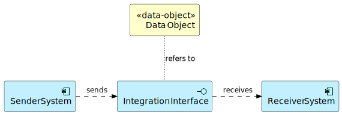

= Enterprise Integration Repository Guidelines
:toc: right
:toc-title: Contents
:toclevels: 2

== Repository Ontology

[plantuml]
--
@startuml
include::../diagrams/repository-ontology.puml[]
@enduml
--
//

== Naming Convention

=== Integration Interface

The integration interface could be named by the following pattern:
[sidebar]
====
I.{Seq. number} - {Data Object Name} from {Sender System} to {Receiver System}
====

For example:

* I.001 - Campaign from Marketing Cloud to Salesforce

=== Logical System

The logical system could be named by the following pattern:
[sidebar]
====
S.{Seq. number} - {System Name}
====
For example:

* S.001 - Salesforce

=== Data Object

The data object could be named by the following pattern:
[sidebar]
====
D.{Seq. number} - {Data Object Name}
====
For example:

* D.001 - Campaign

== Integration Interface Definition

A single integration interface consists of a unique combination of:

* single data object

* single sender system (including the protocol, message format and API)

* single receiver system (including the protocol, message format and API)

== Label Management Approach
Each integration interface should be labeled with the following labels:

* INTEGRATION-INTERFACE

* INTEGRATION-WITH-{SYSTEM_NAME}, where {SYSTEM_NAME} is sender or receiver system in the particular interface. For example, INTEGRATION-WITH-SFMC.

* DATAOBJECT-{OBJECT_NAME}, where {OBJECT_NAME} is a data object in the particular interface. For example, DATAOBJECT-CAMPAIGN.

* Label for associated Integration Blueprint, but the label “.” should be replaces with “-”. For example, CDC (O2C.DI.ETL.L01) use case label should be o2c-di-etl-l01.

* MILESTONE-{MILESTONE_NAME}, if milestone name is defined. For example, MILESTONE-WAVE1.

